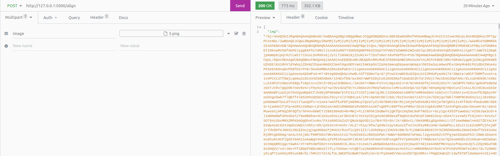

### 1. Align an image horizontally or vertically

### Run the project

```
docker-compose up
```

For POST request: 

Go to: http://127.0.0.1:5000/align

Content-Type: `multipart/form-data`

Input: `an misaligned image file`

Response: `base64 encoded aligned image`

Sample Output:


### 2. Save base64 encoded image to a file

The base64 encoded image will be saved automatically to a given location (output folder) 
when the post request is completed. The function to save base64 encoded image
into a file is given below.
```
def save_image(base64_image_string, filename):
    filename = filename.split(".")[0]
    file_content = base64.b64decode(base64_image_string)

    with open(f"output/aligned_{filename}.jpeg", "wb") as fh:
        fh.write(file_content)
```
